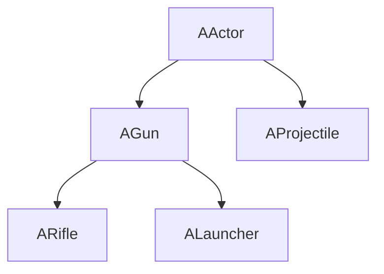
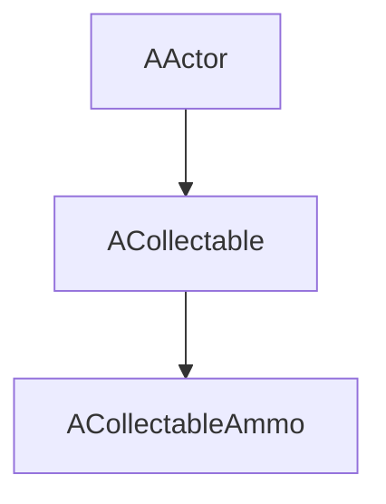

# 클래스 구조도

```mermaid
graph TD;
    AActor-->AGun;
    AGun-->ARifle;
    AGun-->ALauncher;
    AActor-->AProjectile;
```

```mermaid
graph TD;
    AActor-->ACollectable;
    ACollectable-->ACollectableAmmo;
```
