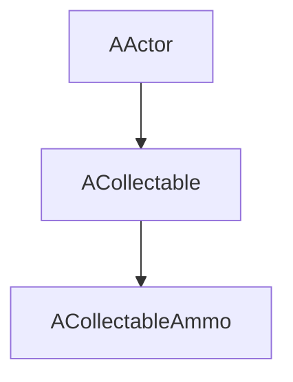

# 클래스 구조도

```mermaid
%%{
  init: {
    'theme': 'base',
    'themeVariables': {
      'primaryColor': '#00ff7f',
      'lineColor':'#8af6af'
    }
  }
}%%
graph TD;
    AActor-->AGun;
    AGun-->ARifle;
    AGun-->ALauncher;
    AActor-->AProjectile;
```

```mermaid
graph TD;
    AActor-->ACollectable;
    ACollectable-->ACollectableAmmo;
```
