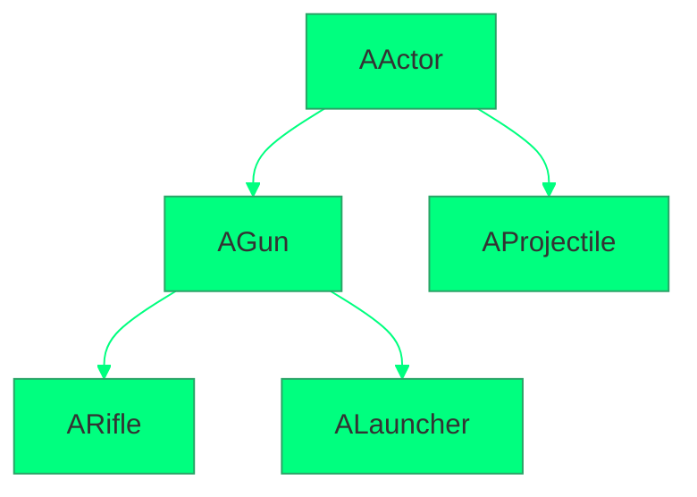
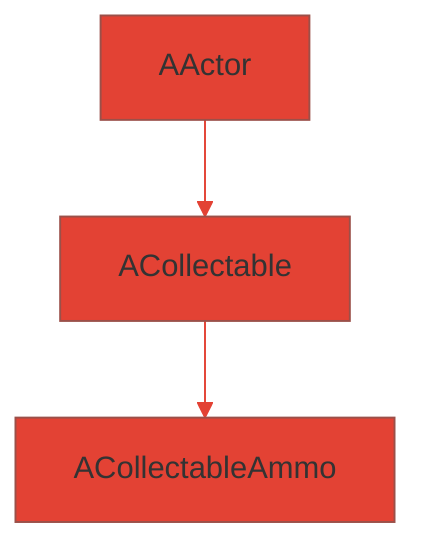
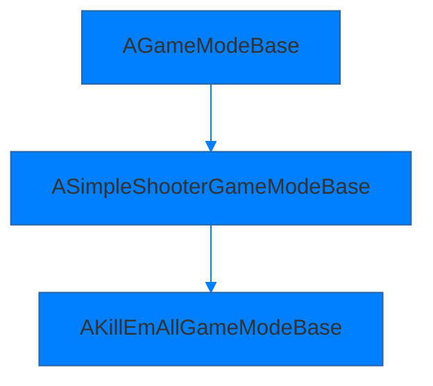

# 클래스 구조도

```mermaid
%%{
  init: {
    'theme': 'base',
    'themeVariables': {
      'primaryColor': '#00ff7f',
      'lineColor':'#00ff7f'
    }
  }
}%%
graph TD;
    AActor-->AGun;
    AGun-->ARifle;
    AGun-->ALauncher;
    AActor-->AProjectile;
```

```mermaid
%%{
  init: {
    'theme': 'base',
    'themeVariables': {
      'primaryColor': '#e34234',
      'lineColor':'#e34234'
    }
  }
}%%
graph TD;
    AActor-->ACollectable;
    ACollectable-->ACollectableAmmo;
```

```mermaid
%%{
  init: {
    'theme': 'base',
    'themeVariables': {
      'primaryColor': '#007fff',
      'lineColor':'#007fff'
    }
  }
}%%
graph TD;
    AGameModeBase-->ASimpleShooterGameModeBase;
    ASimpleShooterGameModeBase-->AKillEmAllGameModeBase;
```
