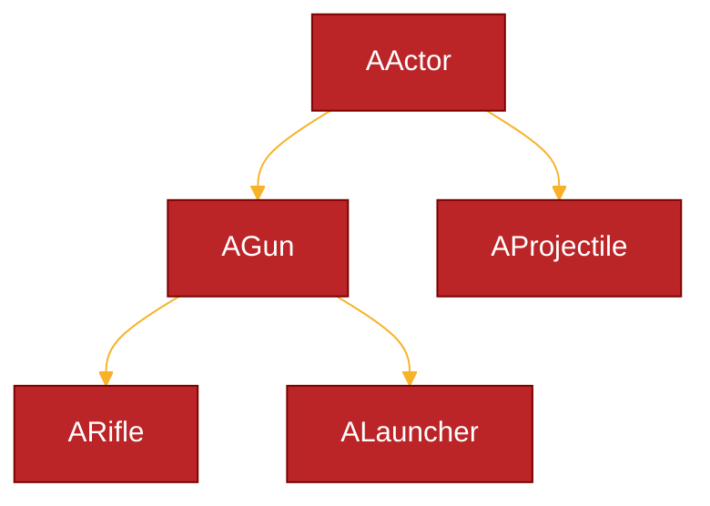
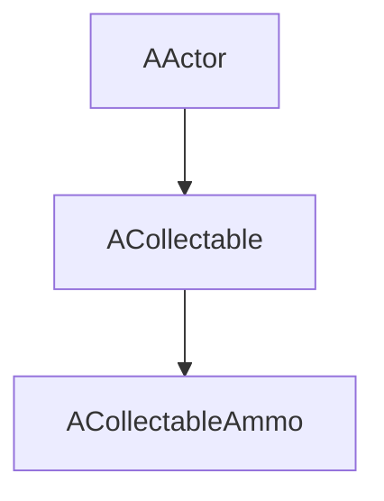

# 클래스 구조도

```mermaid
%%{
  init: {
    'theme': 'base',
    'themeVariables': {
      'primaryColor': '#BB2528',
      'primaryTextColor': '#fff',
      'primaryBorderColor': '#7C0000',
      'lineColor': '#F8B229',
      'secondaryColor': '#006100',
      'tertiaryColor': '#fff'
    }
  }
}%%
graph TD;
    AActor-->AGun;
    AGun-->ARifle;
    AGun-->ALauncher;
    AActor-->AProjectile;
```

```mermaid
graph TD;
    AActor-->ACollectable;
    ACollectable-->ACollectableAmmo;
```
